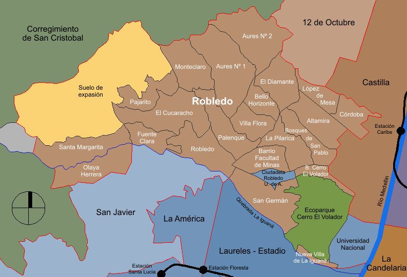

--- 
title: "Poster hurto de moto"
subtitle: "Casos de Hurto a Motocicletas | MEDATA"
# author: "SAMData research seedbed"
# date: "2022/10/07"
output: 
  html_document:
    toc: TRUE
    toc_float: TRUE
    code_download: TRUE
    theme: united
#runtime: shiny
---

<!-- Add comments to markdown document -->
```{r setup, include=FALSE}

my_packages<-(c("readr","dplyr", "ggplot2", "reshape", "mapview", "plotly",
                "forcats","sqldf", "reticulate", "vembedr"))

lapply(my_packages, require, character.only = TRUE)

Sys.getlocale()
Sys.setlocale("LC_ALL", "Spanish.UTF-8")

#data1 <- read.csv("hurto_de_moto.csv", sep=";", na.strings=c("NaN", "Sin dato"))
data1 <- read.csv2("http://medata.gov.co/sites/default/files/medata_harvest_files/hurto_de_moto.csv",
                   header = TRUE, sep = ";", dec = ",", quote = "\"",
                   na.strings=c("NaN", "Sin dato"))

data1<- data1 %>% select(fecha_hecho,sexo,edad,estado_civil, medio_transporte, 
                         conducta, modalidad,conducta_especial,arma_medio,
                         nombre_barrio, codigo_barrio, codigo_comuna, lugar,
                         sede_receptora, bien, categoria_bien, grupo_bien,modelo,
                         color,fecha_ingestion,latitud,longitud)
#Filter Medellín by neighborhood
Med<-data1 %>% select(nombre_barrio,codigo_comuna,latitud,longitud)

Med<-Med[!duplicated(Med[2]),]
Med <- na.omit(Med)

#Filter Robledo neighborhood
ComunaRobledo<-data1 [data1$codigo_comuna == "7", ]

#Cleaning data columns with NA
names(ComunaRobledo)
ComunaRobledo$edad[ComunaRobledo$edad=="-1"] <- NA
ComunaRobledo$nombre_barrio[ComunaRobledo$nombre_barrio=="Sin dato 7 Robledo"] <- NA
ComunaRobledo$codigo_barrio[ComunaRobledo$codigo_barrio=="SIN DATO 7 ROBLEDO"] <- NA
ComunaRobledo$modelo[ComunaRobledo$modelo=="-1"] <- NA

#Extract year, day and hours from date columns
ncol(ComunaRobledo)
ComunaRobledo <- ComunaRobledo %>% mutate (fecha_hecho_=as.Date(fecha_hecho)) %>%
  mutate (año_hurto=format(fecha_hecho_, format="%Y"))%>%
  mutate (mes_hurto=format(fecha_hecho_, format="%B"))%>%
  mutate (día_hurto=format(fecha_hecho_, format="%A"))%>%
  mutate (fecha_hecho= as.POSIXct(fecha_hecho, format="%Y-%m-%dT%H:%M"))%>%
  mutate (hora=format(fecha_hecho, format="%H"))

#Reorder columns
ComunaRobledo<- ComunaRobledo[, c(23,24,25,26,27,2,3,4,5,6,7,8,9,10,11,12,
                                  13,14,15,16,17,18,19,21,22,1,20)]
#delete dataset data1 
#rm(data1)

#Applying filters by sexo and año_hurto
ComunaRobledo$sexo <- as.factor(ComunaRobledo$sexo)
ComunaRobledo2<-ComunaRobledo %>% filter(año_hurto >= 2020)  
ComunaRobledo2$año_hurto<-as.character(ComunaRobledo2$año_hurto)
ComunaRobledo2$longitud<-as.double(ComunaRobledo2$longitud, options(digits=10))
ComunaRobledo2$latitud<-as.double(ComunaRobledo2$latitud, options(digits=10))

knitr::opts_chunk$set(echo=TRUE)
```

```{r dataframes, include=FALSE}

Totales_años<-ComunaRobledo2 %>% group_by(año_hurto) %>%
  summarise(Frecuencia = n())

Totales_años_meses<-ComunaRobledo2 %>% group_by(año_hurto, mes_hurto) %>%  
  summarise(Frecuencia = n())  %>%  
  
#Chronology month order  
mutate(mes_hurto = factor(mes_hurto, c("enero","febrero","marzo",
                                        "abril","mayo","junio",
                                        "julio","agosto","septiembre",
                                        "octubre","noviembre","diciembre" )))

Totales_años_barrios<-ComunaRobledo2 %>% group_by(año_hurto, nombre_barrio) %>% 
  summarise(Frecuencia = n()) 
  
CiudadelaRobledo<-Totales_años_barrios
  
#Filter and join similar neighborhood 
CiudadelaRobledo<-CiudadelaRobledo%>%
  filter(nombre_barrio %in% c("Facultad de Minas U. Nal", 
                              "Facultad de Minas U. Nacional","Universidad Nacional")) %>%
  summarize_if(is.numeric, sum) %>%
  as.list(.) %>%
  c(nombre_barrio = "Facultad de Minas UN") %>%
  bind_rows(CiudadelaRobledo, .)
  
#Filter neighborhood close to Ciudadela Pedro Nel Gómez
CiudadelaRobledo<-CiudadelaRobledo %>% filter(
  grepl('San Germán|B. Cerro el Volador|Ecoparque Cerro El Volador|Facultad de Minas UN|La Pilarica|Fac. Veterinaria y Zootecnia U.De.A.',
        nombre_barrio))

Totales_hora_días<-ComunaRobledo2 %>% group_by(hora, día_hurto) %>% 
  summarise(Frecuencia = n()) %>% 
  
mutate(día_hurto = factor(día_hurto, c("lunes","martes","miércoles",
                                       "jueves","viernes","sábado",
                                       "domingo" )))

mapData<-ComunaRobledo2 %>% group_by(año_hurto, nombre_barrio, longitud, latitud) %>% 
  summarise(Frecuencia = n()) 

Totales_años_modalidad <- ComunaRobledo2 %>% group_by(año_hurto, modalidad) %>% 
  summarise(counter = n()) 
```


```{python, include=FALSE}

# from platform import python_version
# 
# version=python_version()
# 
# import matplotlib.pyplot as plt
# 
# import seaborn as sns

```

## Hurto de moto en Medellín | MEDATA

El hurto de motocicletas en la ciudad de Medellín es un problema social que...


<center>

{width=800}
</center>

## Victima hurto moto por año en la Comuna 7 Robledo

Desde el año 2020 en Medellín se presentó una cifra alta de hurto a motocicleta
a pesar del confinamiento nacional del COVID-19 con 461 casos para la comuna 7 
Robledo. En 2021 hubo un leve aumento del 9.11% con respecto a 2020. Hasta la
fecha, en el tercer trimestre de 2022 se evidencia positivamente un decrecimiento 
de la actividad delictiva hurto a motocicleta en un 40.16% y 34.71% comparado 
con 2021 y 2020 respectivamente.

```{r theft_by_year_Robledo, fig.align='center', echo=FALSE}

ggplot(Totales_años, aes(x=año_hurto, y=Frecuencia) )+
  geom_bar(stat = "identity", fill = "paleturquoise4",position="stack") +
  geom_text(aes(label=Frecuencia),position="stack",vjust=-0.5)+
  theme_light()+
  labs(x= "Año",
    y = "Cantidad de personas",
    title = "Victima hurto moto por año en la Comuna 7 Robledo",
    caption = "Casos de Hurto a Motocicletas | MEDATA")

```

## Victima hurto moto por mes en la Comuna 7 Robledo

Desde el año 2020 en Medellín se presentó* una cifra la
fecha, en el tercer trimestre de 2022 s


```{r theft_by_month_Robledo, fig.align='center', echo=FALSE}
Plot=ggplot(Totales_años_meses, aes(x=mes_hurto, y=Frecuencia, color=año_hurto, 
                               group= año_hurto))+ 
  geom_line(stat = "identity", fill = "paleturquoise1", lwd=1 ) +
  geom_text(aes(label=Frecuencia),vjust=-1)+
  #scale_x_discrete(guide = guide_axis(angle = 90))+
  #theme(strip.text.x = element_text(angle = 90))+
  #theme(axis.text.x = element_text(angle = 90))+
  theme_light()+
  guides(color = guide_legend(title = "Año del hurto"))+
  labs(x= "Mes",
    y = "Cantidad de personas",
    title = "Victima hurto moto por mes",
    subtitle = "Comuna 7 Robledo",
    caption = "Casos de Hurto a Motocicletas | MEDATA")

ggplotly(Plot)
```

## Victima hurto moto por modalidad en la Comuna 7 Robledo
```{r theft_by_modeOf_Robledo, echo=FALSE}
 
ggplot(Totales_años_modalidad,aes(x = fct_reorder(modalidad, counter, .desc=TRUE), 
                                  y = counter,  fill=año_hurto))+  
  geom_bar(stat = "identity", position = position_dodge(0.9) , color = "black") +
  #scale_fill_manual(values = c("lightsalmon", "lightblue", "palegreen")) +
  geom_text(aes(label = counter), vjust = -0.3, position = position_dodge(1),
    color = "black", fontface = "bold", size = 4)  +
  ggtitle("Victimas de hurto por modalidad") + xlab("Modalidad") + ylab("Años") +
  theme_light() +
  theme(plot.title = element_text(hjust = 0.5, face = "bold", size = 20),
        axis.text.x = element_text(face = "bold", size = 10),
        axis.text.y = element_text(face = "bold", size = 10),
        axis.title.x = element_text(face = "bold", size = 10),
        axis.title.y = element_text(face = "bold", size = 10),
        legend.title = element_text(face = "bold", hjust = 0.5, size = 12),
        legend.text = element_text(size = 12),
        legend.justification = "top",
        legend.background = element_rect(size = 0.5, linetype = "solid", color = "black"),
        legend.key = element_blank()
        ) +
  labs(title = "Víctimas de hurto por modalidad",
        x = "Modalidad", y = "Cantidad", fill = "Año",
       caption = "Casos de Hurto a Motocicletas | MEDATA")
```


## Victima hurto moto por mes en la Comuna 7 Robledo
## Inmediaciones de la ciudadela Pedro Nel Gómez

Desde el año 2020 en Medellín se presentó* una cifra la
fecha, en el tercer trimestre de 2022 s


```{r theft_by_month_Ciudadela, fig.align='center', echo=FALSE}

ggplot(CiudadelaRobledo, aes(x = fct_reorder(nombre_barrio, Frecuencia, .desc=TRUE), 
                             y= Frecuencia, fill = año_hurto)) +
  geom_bar(stat="identity", width=.6, position = "dodge")+
  scale_x_discrete(guide = guide_axis(angle = 45))+
  geom_text(
    aes(label = Frecuencia, y = Frecuencia + 0.05),position = position_dodge(0.6),
    vjust = -.6,  hjust=0.8)+
  theme_light()+
  ylim(0, 20)+
  labs(x= "Nombre del barrio",
    y = "Cantidad de personas",
    fill="Año del hurto",
    title = "Victima hurto moto por mes",
    subtitle = "Inmediaciones de la ciudadela Pedro Nel Gómez",
    caption = "Casos de Hurto a Motocicletas | MEDATA")

```

## Victima hurto moto por día del 2020 al 2022 en la Comuna 7 Robledo

Desde el año 2020 en Medellín se presentó* una cifra la
fecha, en el tercer trimestre de 2022 s

```{r heatmap_theft_by_year_up_to_2020_Robledo, fig.align='center', echo=FALSE}
  
Plot = ggplot(Totales_hora_días, aes(x = día_hurto, y = hora, fill = Frecuencia))+
      geom_raster()+
      geom_tile(aes(fill = Frecuencia),width=1,color = "white", na.rm = TRUE)+
      scale_fill_gradient(low = "thistle1", high = "gray15")+
      theme_minimal()+
      labs(x= "Día de la semana",
        y = "Hora del día",
        fill="Cantidad \nde hurtos",
        title = "Victima hurto moto por día del 2020 al 2022",
        subtitle = "Comuna 7 Robledo",
        caption = "Casos de Hurto a Motocicletas | MEDATA")

ggplotly(Plot)
```

## Ubicación geográfica hurto moto del 2020 al 2022 en la Comuna 7 Robledo
## Inmediaciones de la ciudadela Pedro Nel Gómez

Desde el año 2020 en Medellín se presentó una cifra la
fecha, en el tercer trimestre de 2022

```{r map_theft_by_year_up_to_2020_Ciudadela, echo=FALSE}

mapData<-mapData %>% filter(
   grepl('San Germán|B. Cerro el Volador|Ecoparque Cerro El Volador|Facultad de Minas U. Nal|Facultad de Minas U. Nacional|Universidad Nacional|La Pilarica|Fac. Veterinaria y Zootecnia U.De.A.',
        nombre_barrio))

mapview(mapData, xcol = 'longitud', ycol = 'latitud', crs = 4269, grid = FALSE)

```


